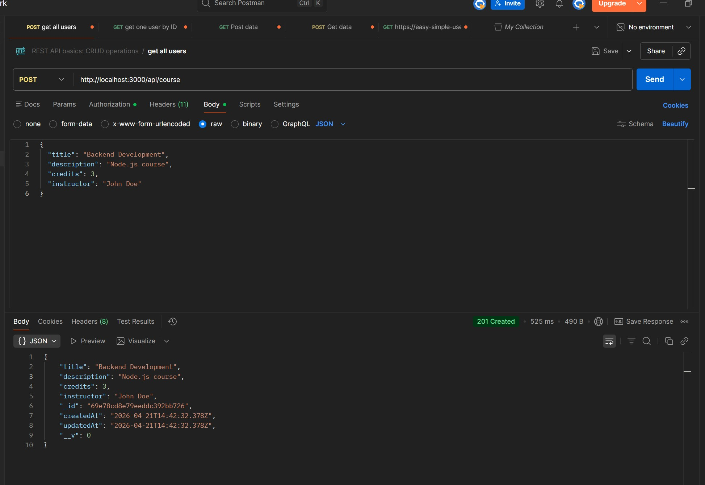
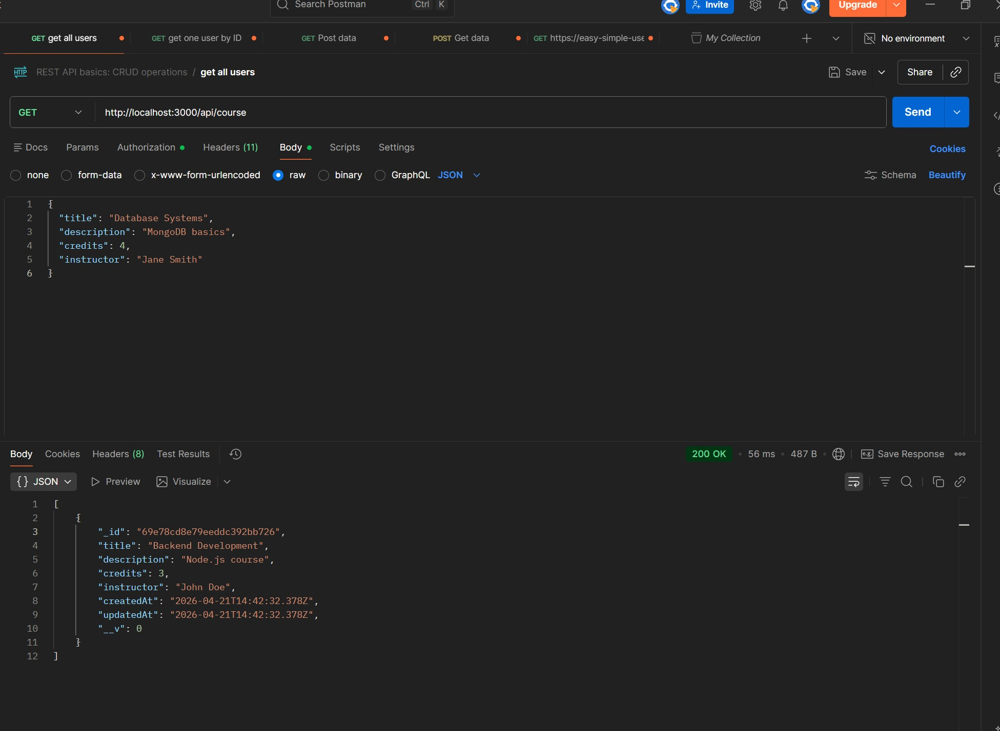
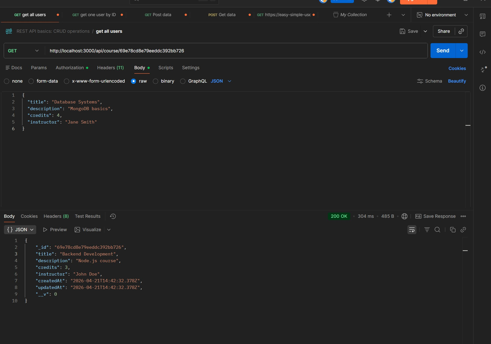
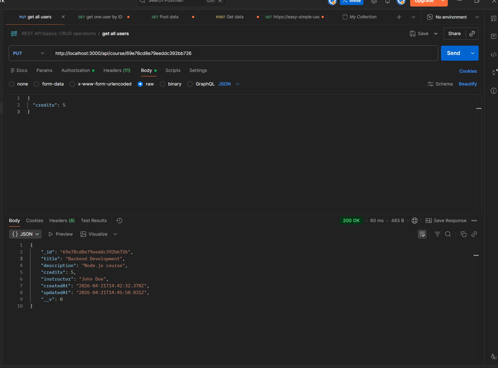
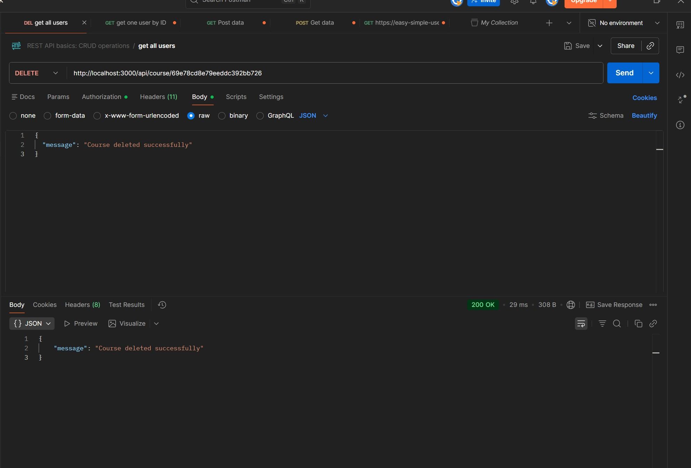
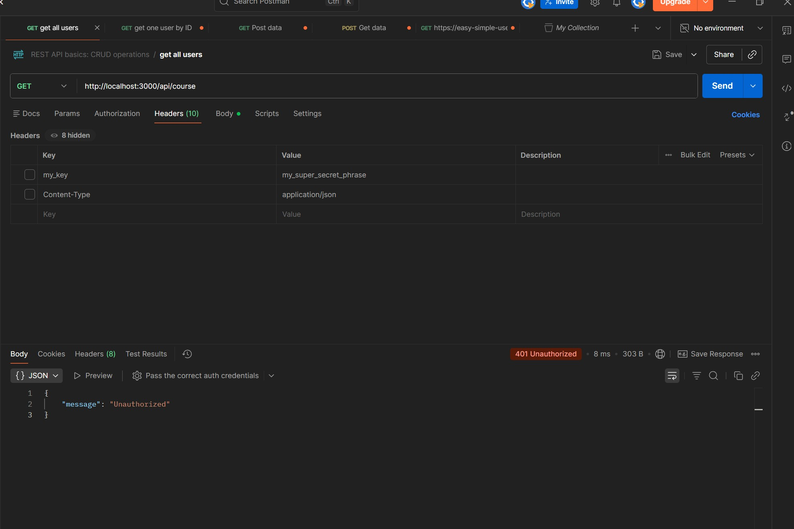

# Server-Side JavaScript Final Assessment – Course API

## 📌 Overview

This project is a RESTful API built with Node.js, Express, and MongoDB Atlas.
It extends the existing Student Management API by adding a new resource: **Course**.

The API provides full CRUD functionality and uses middleware to protect all routes.

---

## 🚀 Features

* Create a new course
* Get all courses
* Get a course by ID
* Update a course
* Delete a course
* Protected routes using authentication middleware

---

## 🛠️ Technologies Used

* Node.js
* Express.js
* MongoDB Atlas
* Mongoose
* dotenv

---

## 📂 Project Structure

```plaintext
project-root/
│
├── BACK/
│   ├── models/
│   │   └── courseModel.js
│   ├── services/
│   │   └── courseService.js
│   ├── controllers/
│   │   └── courseController.js
│   ├── routes/
│   │   └── courseRoute.js
│   ├── middleware/
│   │   └── auth-middleware.js
│
├── routes/
│   └── students.js
├── controllers/
├── services/
├── index.js
├── .env
├── package.json
```

---

## ⚙️ Environment Variables

Create a `.env` file in the root directory:

```env
MONGO_URI=your_mongodb_connection_string
PORT=3000
```

---

## ▶️ Run the Project

Install dependencies:

```bash
npm install
```

Start development server:

```bash
npm run dev
```

Server runs on:

```bash
http://localhost:3000
```

---

## 📡 API Endpoints

### Base URL:

```bash
http://localhost:3000/api/course
```

---

### 🔹 Get all courses

```http
GET /
```

### 🔹 Get course by ID

```http
GET /:id
```

### 🔹 Create course

```http
POST /
```

**Body (JSON):**

```json
{
  "title": "Backend Development",
  "description": "Node.js course",
  "credits": 3,
  "instructor": "John Doe"
}
```

---

### 🔹 Update course

```http
PUT /:id
```

---

### 🔹 Delete course

```http
DELETE /:id
```

---

## 🔐 Authentication

All routes are protected by a custom authentication middleware.

Add this header to all requests:

```http
Authorization: Bearer test123
```

If the token is missing:

```json
{
  "message": "Unauthorized"
}
```

---

## ✅ Status Codes

* 200 OK – Successful request
* 201 Created – Resource created
* 400 Bad Request – Invalid input
* 401 Unauthorized – Missing/invalid token
* 404 Not Found – Resource not found

---
## 📬 API Testing (Postman)

### ✅ Create Course


### ✅ Get All Courses


### ✅ Get Course by ID


### ✅ Update Course


### ✅ Delete Course


### 🔒 Unauthorized (no token)

## ✅ Checklist

- [x] POST /api/course — create entries
- [x] GET /api/course — get all
- [x] GET /api/course/:id — get by ID
- [x] PUT /api/course/:id — update
- [x] DELETE /api/course/:id — delete
- [x] GET without token — returns 401
## 📬 Testing

All endpoints were tested using Postman.

---

## 👩‍💻 Author

Irina Kiseleva
